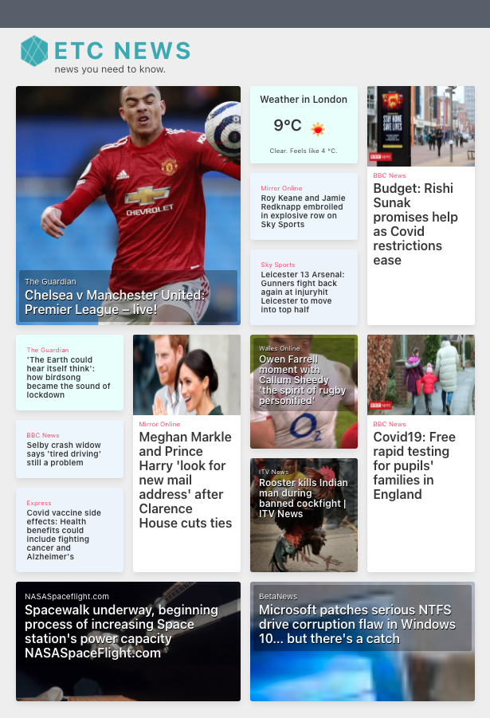
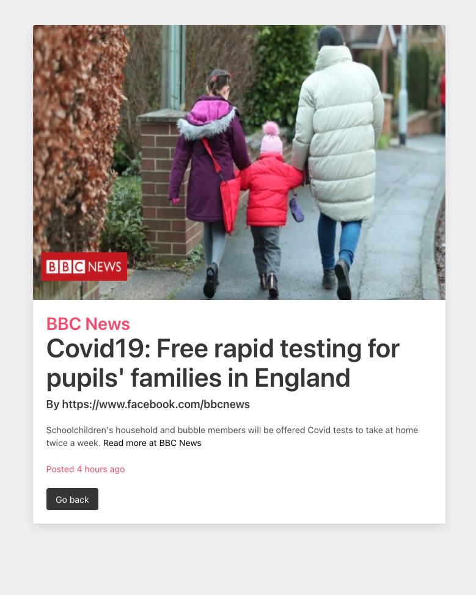
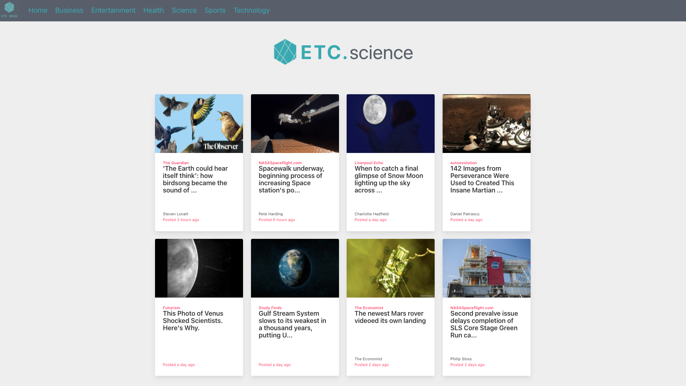

### General Assembley Software Engineering Immersive Course

# ETC News Site

## news you need to know.

### The brief
ETC. News was born from a 48-hour, pair programming 'hackathon' to create and deploy a simple React app that consumes an external RESTful API. The app should also allow users to navigate around using React Router. 

Our idea was to build a site that gave users a snapshot of UK news, presented in an easily digestible format and easy to navigate.

### Our external APIs
[newsapi.org](https://newsapi.org/) and [openweathermap.org](https://openweathermap.org/)

### Technologies used
* Javascript
* HTML
* CSS
* ReactJS
* Webpack
* Bulma
* Axios

## The logic

### Planning the routes
The structure of our design was pretty simple: 

* A homepage which pulls a selection of stories from the newsapi.org API. Each of these stories links directly to an individual article page.

* A navigation bar with links which allows users to select specific news categories. Each of these links routes to a category page, showing stories only for that category. Again, by clicking on any of these stories, the user is routed to an individual article page. 

### The original plan...

During the development phase, we had created a dynamic routing path, which linked to each category page using a category id. This meant that we only needed one category page template for all six categories and React did the rest. 

~~~javascript
const App = () => (
  <BrowserRouter>
    <NavBar />
    <Switch>
      <Route exact path="/ETC-News/" component={Home}/>
      <Route exact path="/ETC-News/category/:id" component={Category}/>
      <Route exact path="/ETC-News/article" component={Article}/>
      <Route exact path="/ETC-News/category/:id/article" component={Article}/>
    </Switch>
  </BrowserRouter>

)
~~~

We had to change things during deployment but more on that later...

### Pulling data
Getting into the api

### Styling
Bulma

## The user experience

### Interactivity
Ability to navigate with ease

### Look and Feel
Attractively presented

## Next time...

### Improvements
Homepage - better way of coding the data like map but with different size tiles.

### Future additions
World news
Search bar
Load more option

### Bugs squished (and not-so-squished)
API access!
Deployment - dynamic category loading and weather

## Assets
Date js
logo maker

